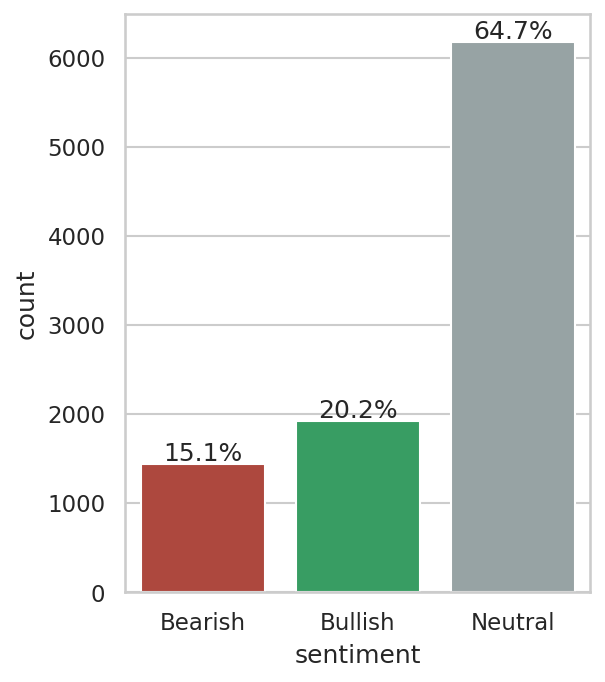
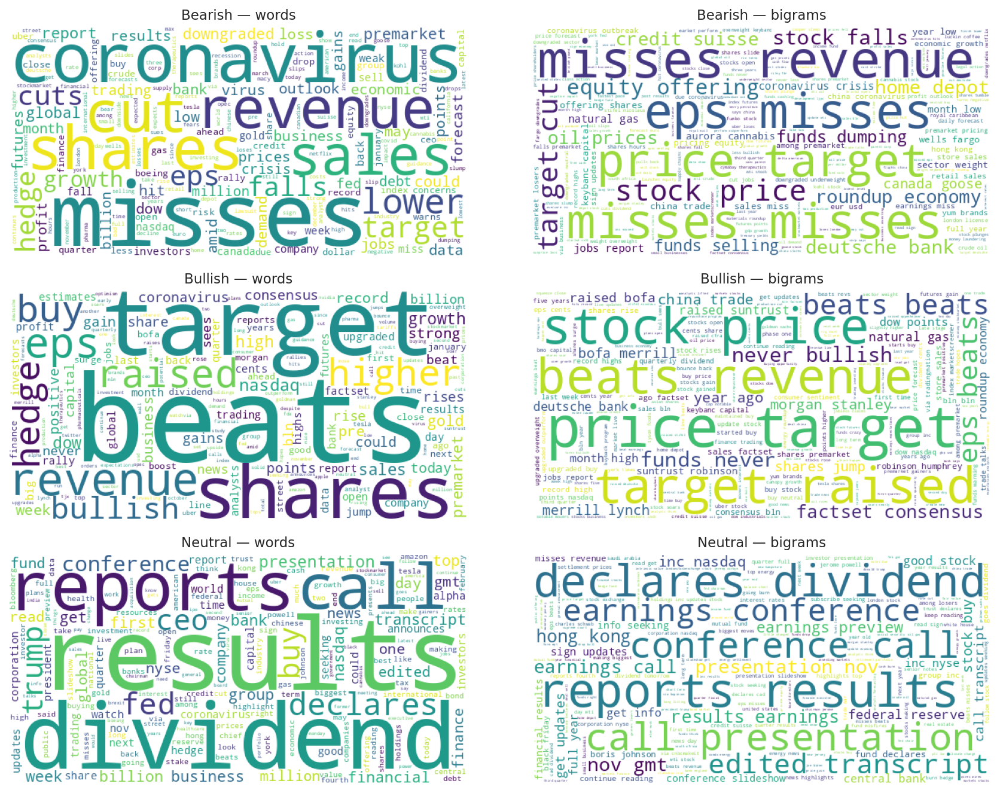
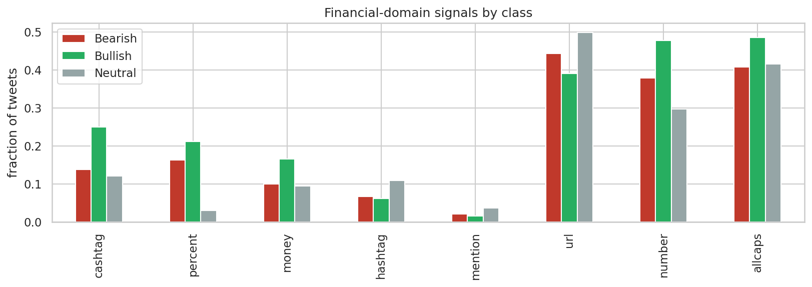
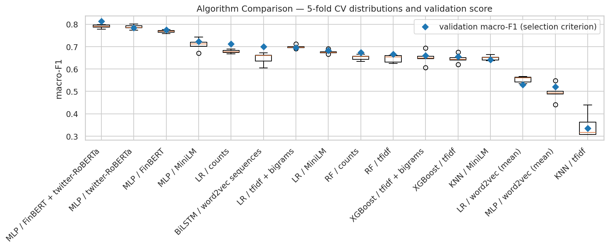
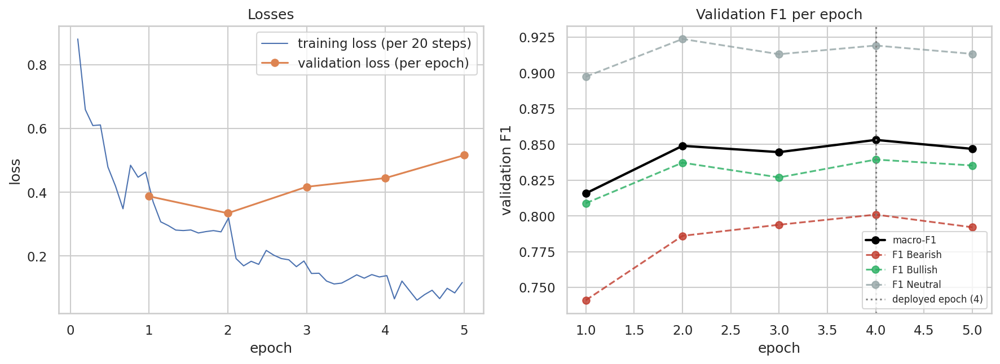
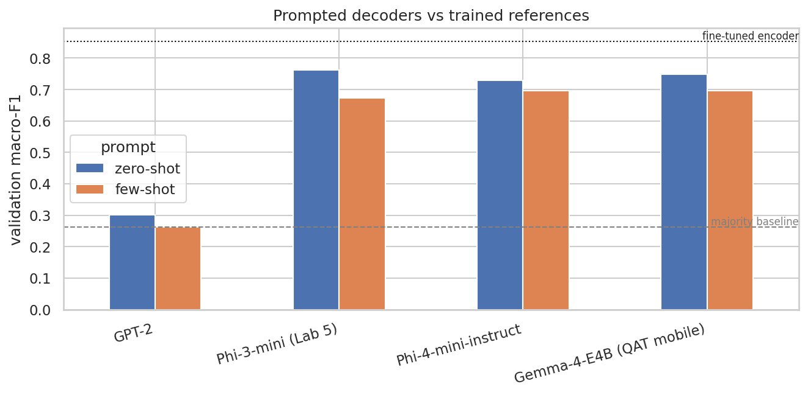
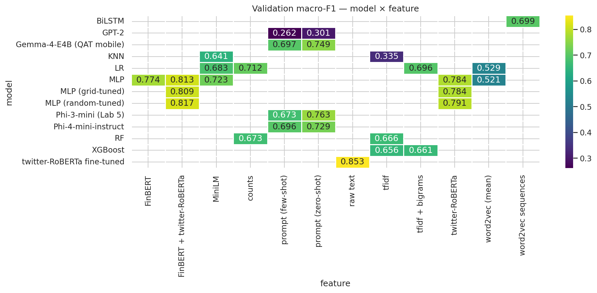
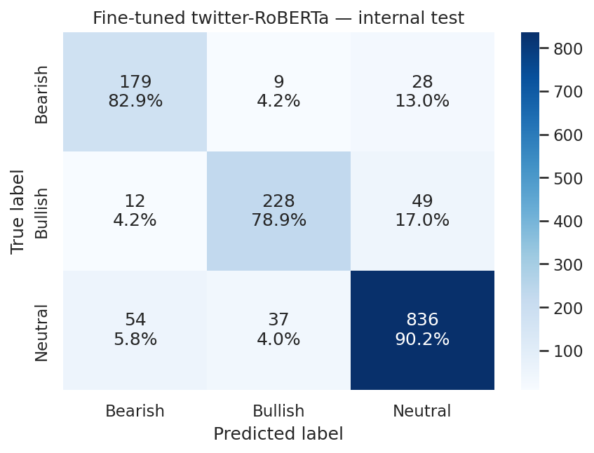

# Data Exploration

The training corpus contains 9,543 financial tweets, each labelled **Bearish (0)**, **Bullish (1)** or **Neutral (2)**. The corpus is clean: it has no missing values, no empty strings and no duplicate tweets, so no rows had to be removed and duplicates cannot leak across data splits. The distributed test corpus contains 2,388 unlabelled tweets with an explicit `id` column, which is used directly as the identifier in `pred_12.csv`. The handout mentions 299 test rows, but the distributed file contains 2,388 and predictions cover all of them.

## Class distribution

The three classes are strongly imbalanced, as shown in Figure 1: Neutral accounts for 64.7% of the tweets (6,178), Bullish for 20.2% (1,923) and Bearish for 15.1% (1,442). This imbalance shapes the rest of the project. A classifier that always predicted Neutral would already be correct on almost two thirds of the corpus while never identifying a single Bearish or Bullish tweet, which are precisely the classes a market participant acts on. Overall accuracy is therefore not a sufficient measure of quality on this corpus, and the evaluation must weight performance on the minority classes explicitly. In practical terms, all data splits and cross-validation are stratified so that the minority classes remain represented, classifiers that support it receive balanced class weights, and per-class results are inspected for every model.

{width=46%}

## Class vocabulary

Nineteen words, among them *stock(s)*, *market(s)*, *economy*, *china*, *trade*, *oil*, *price* and *earnings*, rank among the 50 most frequent words of all three classes simultaneously. They are general financial vocabulary rather than sentiment carriers, and they were excluded from the visualisations so that class-specific vocabulary becomes visible. The exclusion applies only to the figures; models receive the full text.

As shown in Figure 2, the remaining vocabulary separates the classes clearly. Bearish tweets are dominated by miss and downgrade language (*misses*, *cut*, *lower*, *falls*, *downgraded*) together with crisis terms such as *coronavirus*; Bullish tweets mirror them with beat and upgrade language (*beats*, *raised*, *higher*, *buy*, *target*, *eps*); Neutral tweets use the factual vocabulary of the corporate calendar (*results*, *reports*, *declares*, *dividend*, *conference*, *transcript*). The bigrams in the same figure sharpen this picture: after removing eleven boilerplate pairs common to all classes (*stock market*, *wall street*, *seeking alpha*), the leading Bearish and Bullish bigrams turn out to be built on identical stems that differ only in the verb, such as *target cut* against *target raised* and *misses revenue* against *beats revenue*. Sentiment in this corpus is thus encoded in short word pairs, which motivates including n-grams in the Bag-of-Words feature space.

Two further consequences follow. The strong lexical separability suggests that a simple word-frequency model will already be competitive, giving the more expensive contextual models a concrete baseline to beat. And because company and data-vendor names (*marketscreener*) rank among the most frequent tokens, a classifier could end up learning company identities rather than sentiment; cashtags are therefore normalised to a generic `ticker` token during preprocessing.

{width=100%}

## Financial-domain signals

Finance-specific tokens that generic text-cleaning pipelines delete carry class signal in this corpus, as shown in Figure 3. Percentage expressions occur in 21.2% of Bullish and 16.3% of Bearish tweets but in only 3.1% of Neutral ones: directional moves such as "+5%" express an opinion about a stock, while neutral reporting rarely quantifies one. Cashtags lean Bullish (25.1%, against roughly 13% in the other classes), as do bare numbers (47.7% against 29.8% in Neutral). Neutral tweets are the most news-like, with the highest incidence of URLs (49.8%), hashtags (11.0%) and `@mentions` (3.8%).

A cleaning step that deletes every digit, `%` and `$` would therefore erase the strongest signal separating opinionated from neutral tweets. For this reason the preprocessing stage normalises tickers, percentages and numbers to placeholder tokens instead of deleting them, and keeps negation words that standard stop-word lists would remove.

{width=72%}

## Tweet length

Tweets are short and uniform: the median tweet has 11 whitespace tokens (mean 12.2, maximum 32), and per-class medians vary only between 11 and 12, so length itself does not separate the classes. The tail of the distribution sets the sequence-model configuration: the 95th percentile is 21 tokens and the 99th is 23, so a maximum sequence length of 32 word-tokens covers every tweet without truncation, and transformer tokenizers receive headroom above this value to absorb subword expansion.

# Data Preprocessing

## Corpus split

The labelled corpus was split into training, validation and internal test sets in a 70/15/15 ratio (6,679 / 1,432 / 1,432 tweets), stratified by class so that each subset preserves the class distribution to within 0.1 percentage points, with a fixed random seed for reproducibility. An internal test set is needed because the distributed `test.csv` is unlabelled and serves only to produce the submission file: without a held-out portion of the labelled data, the validation set would be used both to select models and to estimate final performance, and that estimate would be optimistically biased. The protocol is therefore: candidate models are compared and tuned on the validation set, the selected final model is scored once on the internal test set, and the submission model is retrained on all 9,543 labelled tweets before predicting `test.csv`.

The integrity checks (duplicate, null and empty-text removal) run before the split, because a duplicate tweet present in two subsets would let the model see part of its evaluation data during training; on this corpus the checks removed nothing, so the guarantee is structural. Every step that learns parameters from data — vectorizers, vocabularies, scalers and the classifiers themselves — is fit on the training subset only, inside scikit-learn pipelines, so the same leak-free behaviour holds during cross-validation.

## Cleaning pipeline

Six preprocessing techniques were implemented and demonstrated individually in the tests notebook: regular-expression normalisation (URLs, mentions, cashtags, percentages and numbers), lowercasing, special-character removal, stop-word removal, lemmatisation and stemming. They compose into a single finance-aware cleaner whose design follows from the exploratory findings of the previous section rather than from generic defaults:

- **URLs and `@mentions` are removed.** Twitter-shortened links are opaque identifiers and handles are names; neither contributes sentiment vocabulary.
- **Financial tokens are normalised, not deleted.** Cashtags become `ticker`, percentage expressions become `pct` and bare numbers become `num`. This keeps the strongest opinionated-versus-neutral signal found in the data (percentages appear in 21.2% of Bullish and 16.3% of Bearish tweets against 3.1% of Neutral) while collapsing thousands of distinct strings into three shared tokens. Replacing company tickers with a generic token also prevents a classifier from memorising company identities instead of sentiment vocabulary.
- **Special-character removal runs after the normalisation**, so the inserted placeholder tokens survive the letters-only step; lowercasing is applied first, and the placeholders are inserted already in lower case.
- **Stop words are removed with negation kept.** The standard NLTK stoplist contains *not*, *no* and *never*; deleting them can invert the meaning of a tweet ("not bullish"), so a negation list is subtracted from the stoplist before filtering.
- **Lemmatisation is preferred over stemming.** Both were implemented and compared on example sentences; lemmatisation maps inflections to dictionary forms (*shares* → *share*) while stemming truncates to non-words (*raised* → *rais*). Since later sections inspect the most discriminative features, readable dictionary forms were retained.

As an example, the tweet "*$ORLY strong up 11.7% into large volume pocket w/ room to $360*" becomes "*ticker strong pct large volume pocket w room num*".

The cleaned text feeds the Bag-of-Words and word2vec representations only. Transformer encoders receive the raw text, because their subword tokenizers handle casing, punctuation and unknown words natively, and removing that surface information would discard cues those models exploit.

# Feature Engineering

Three families of representations feed the classification stage, summarised in Table 1: sparse Bag-of-Words vectors and averaged word2vec embeddings (Mikolov et al., 2013) computed on the cleaned text, and transformer sentence embeddings computed on the raw text. Every representation that learns parameters does so on training data only: vectorizer vocabularies and document-frequency weights are fit inside the model pipelines on training folds, and the word2vec model is trained on the training split.

```{=typst}
#align(center, table(
  columns: 4,
  align: (left, center, center, center),
  stroke: 0.5pt + luma(140),
  inset: 6pt,
  table.header([*Representation*], [*Dimensions*], [*Input*], [*Parameters learned from*]),
  [Term counts / TF-IDF], [4,600 (sparse)], [cleaned text], [training folds],
  [TF-IDF + bigrams], [9,104 (sparse)], [cleaned text], [training folds],
  [word2vec, averaged], [100 (dense)], [cleaned text], [training split],
  [MiniLM sentence embeddings], [384 (dense)], [raw text], [frozen, pretrained],
  [FinBERT — _Extra Work_], [768 (dense)], [raw text], [frozen, pretrained],
  [twitter-RoBERTa — _Extra Work_], [768 (dense)], [raw text], [frozen, pretrained],
))
```

Table 1: The representation families produced for the classification stage.

## Bag-of-Words

Three variations were implemented: raw term counts, TF-IDF weighting, and TF-IDF over unigrams and bigrams. With terms required to appear in at least two training tweets, the unigram vocabulary contains 4,600 entries; adding bigrams roughly doubles it to 9,104, and the matrices remain extremely sparse (0.11–0.16% of entries are non-zero), a regime that linear models handle natively. A worked example in the tests notebook traces one tweet ("*WWE stock price target cut to \$57 from \$79 at Benchmark*") through all three variants: raw counts store frequencies alone; TF-IDF shifts weight from corpus-common to rare words (*stock* receives 0.21 against 0.54 for *wwe*, although both occur once in the tweet); and the bigram variant adds word pairs with typically above-average weight, because pairs are rarer than the words they contain. All six mirror-verb bigrams identified in the exploratory analysis (*target cut/raised*, *miss/beat revenue*, *eps miss/beat*) survive cleaning and enter the vocabulary in lemmatised form, so the phrase-level sentiment signal is available to every model trained on this representation.

## word2vec

A skip-gram word2vec model was trained on the 6,679 training tweets (100 dimensions, context window 5, minimum count 2, 10 epochs, single-threaded for reproducibility), and each tweet is represented as the mean of its in-vocabulary word vectors. Training on the project corpus alone keeps the representation leak-free but exposes the limits of 6,679 short texts. The model does learn the earnings cluster — the nearest neighbours of *beat* include *miss*, *eps* and *revenue* — yet *beat* and *miss* are each other's closest neighbours: antonyms occur in the same contexts, so distributional similarity does not encode sentiment polarity, and averaging word vectors may blur exactly the Bearish/Bullish distinction this task requires. Neighbourhoods of rarer words are noisy (*bullish* neighbours include *burn* and *crazy*), which is consistent with the small corpus. This sets a concrete expectation for the evaluation: averaged word2vec should be the weakest family, and pretrained encoders should recover what the small corpus cannot provide.

## Transformer encoders

Sentence embeddings were extracted with the all-MiniLM-L6-v2 sentence-transformer (Wang et al., 2020; 384 dimensions). The encoder is frozen, so this is feature extraction rather than fine-tuning, and it receives raw text for the reasons given in the preprocessing section. Embeddings for all splits are computed once and cached; encoding runs on GPU when available and falls back to CPU.

**Extra Work.** Two additional transformer encoders beyond the required one were applied, chosen to match the domain from complementary angles: FinBERT, pretrained on financial text (Araci, 2019), and twitter-RoBERTa, pretrained on tweets (Barbieri et al., 2020). For both, a tweet is represented by the mean of the last hidden state over its real tokens, giving 768-dimensional frozen embeddings.

Encoded under every representation, the same example tweet shows the two regimes side by side: the TF-IDF row activates 14 named features out of 9,104, each readable on its own (*target cut* among them), while the dense families produce vectors in which every coordinate is non-zero and individually meaningless — 100, 384 or 768 dimensions whose information lies in the distances between tweets rather than in any single value. The two regimes therefore offer the classifiers different evidence, explicit lexical features against pretrained semantic context, and the classification stage measures which carries more sentiment signal.

# Classification Models

Model selection follows the cost structure of the problem. A missed Bearish tweet leaves downside risk unwatched and a missed Bullish tweet forfeits an opportunity, and both of these expensive errors live in the minority classes, so macro-averaged F1 on the validation split is the selection criterion. The two performance estimators have fixed, distinct roles throughout: stratified five-fold cross-validation on the training split tunes hyperparameters and measures the stability of each candidate, the validation split selects between models, and the internal test set remains untouched until the single final measurement. Classifiers that support cost-sensitive training run with balanced class weights, and every Bag-of-Words model is a scikit-learn pipeline whose vectorizer is fitted inside each training fold, so cross-validation remains leak-free by construction.

Sixteen candidate models pair the representation families with the algorithm classes: K-nearest-neighbours on TF-IDF and on MiniLM embeddings, Logistic Regression on counts, TF-IDF with bigrams, word2vec and MiniLM, Random Forests on counts and TF-IDF, XGBoost on both TF-IDF variants, multilayer perceptrons on each dense representation, and a BiLSTM over word2vec-initialised token sequences. As shown in Figure 4, transformer-encoder features dominate: MLPs on frozen embeddings occupy the four best validation ranks, led by the concatenation of FinBERT and twitter-RoBERTa embeddings at a validation macro-F1 of 0.813, which confirms that the two domain views are complementary rather than redundant. The expectations recorded during exploration are confirmed quantitatively. Logistic Regression on raw counts reaches 0.713 while averaged word2vec stays at or below 0.53, and the same KNN algorithm scores 0.335 on sparse TF-IDF but 0.641 on dense MiniLM embeddings, isolating representation geometry, not the algorithm, as the driver. The BiLSTM reaches 0.699, level with the lexical baselines: modelling word order recovers much of what averaging word vectors destroys, while a recurrent model trained from scratch on 6,679 tweets remains below every pretrained encoder.

{width=100%}

The two leading candidates, both MLPs on transformer embeddings, were tuned with GridSearchCV over a focused grid and RandomizedSearchCV over a wider space under the same five-fold protocol. The random search produced the best frozen-representation model — a single hidden layer of 256 units with weak regularisation — at a validation macro-F1 of 0.817, and did so while overfitting less than the grid winner (training macro-F1 of 0.886 against 0.929 at lower validation score), illustrating that a wider, sampled search space can find flatter optima than an exhaustive narrow grid.

The final model trains the encoder itself. The twitter-RoBERTa checkpoint — a RoBERTa base model (Liu et al., 2019) pretrained on 124M tweets and prepared for sentiment analysis within the TweetEval/TimeLMs effort (Barbieri et al., 2020; Loureiro et al., 2022) — is fine-tuned end-to-end — all 124.6M parameters, embeddings, the twelve transformer blocks and the 3-class head receive gradient updates — with a learning rate of 2e-5 and weight decay of 0.01 — the learning rate sits in the fine-tuning grid recommended by Devlin et al. (2019) and is the value Sun et al. (2019) identify as small enough to avoid catastrophic forgetting of pretrained knowledge, and the weight decay follows the BERT training configuration (Devlin et al., 2019). The maximum sequence length of 64 subword tokens covers the 99th-percentile tweet length found in exploration with headroom for subword expansion. The epoch budget is selected rather than asserted: training runs for up to five epochs with per-epoch validation, and the deployed weights are those of the epoch with the best validation macro-F1. Figure 5 documents the evolution: validation loss reaches its minimum at epoch 2 and rises afterwards while macro-F1 recovers to its peak at epoch 4 — the model grows over-confident without becoming less accurate — which is why epoch selection uses the task metric rather than the loss. The deployed epoch-4 model reaches a validation macro-F1 of 0.853 (accuracy 0.885), with the best minority-class results of any model: Bearish recall of 0.82 and Bullish recall of 0.84.

{width=100%}

## Extra Work — Decoder Models for Classification

Beyond the encoder-based models, four decoder (generative) models classify by prompting alone, with no training. GPT-2 (Radford et al., 2019; 124M parameters, completion-only) anchors the comparison historically; Phi-3-mini-4k-instruct (3.8B, the model used in Lab 5) and its successor Phi-4-mini-instruct (3.8B) represent dense instruction-tuned models; and Gemma-4-E4B (effective 4B parameters in 3.5 GB through quantisation-aware mobile packaging) represents current efficient deployment. Every model receives the same instruction — classify the tweet as exactly one of Bearish, Bullish or Neutral — in a zero-shot and a few-shot variant whose three exemplars are drawn from the training split only, generates deterministically, and passes through a strict parser that takes the earliest label word and falls back to the majority class when none is present. Predictions are evaluated on the same validation split as every other model.

Figure 6 summarises the eight runs against two references. Instruction tuning, not the decoder architecture itself, is what makes prompted classification work: GPT-2 stays at majority-baseline level — zero-shot 0.301, and its few-shot variant scores exactly the always-predict-Neutral macro-F1 of 0.262 because its continuations almost never contain a usable label — while all three instruct models reach 0.73–0.76 zero-shot. The best decoder, Phi-3-mini at 0.763, exceeds every Bag-of-Words, word2vec and BiLSTM model in this project without having seen a single labelled example; the fine-tuned encoder nonetheless keeps a clear lead at 0.853, so 6,679 labelled examples still beat prompting. Few-shot prompting hurts all three instruct models (Phi-3 by 0.09, Phi-4 by 0.03 and Gemma by 0.05 macro-F1): the penalty replicates across model families, indicating that one fixed exemplar per class anchors these models on surface patterns of the exemplars more than it informs the decision. Two further observations follow from the comparison: Phi-4-mini trails its predecessor Phi-3-mini on this corpus (0.729 against 0.763 zero-shot), so generational benchmark gains do not transfer uniformly to a specific task, and the 3.5 GB quantisation-aware Gemma matches the 7.7 GB dense models, giving up nothing on this task at half the memory.

{width=88%}


# Evaluation and Results

All 29 configurations were evaluated on the identical validation split with the same metric set — Accuracy, Precision, Recall and F1, reported per class and as macro averages, complemented by weighted F1, balanced accuracy and the Matthews correlation coefficient. Table 2 lists the leading model of each family against the majority baseline, and Figure 7 condenses the full grid: validation macro-F1 for every model × representation pair that was trained. Performance tracks how deeply the labelled data is used. The fine-tuned encoder leads at 0.853; the domain-matched frozen-embedding MLPs follow (0.774–0.817, with the tuned FinBERT + twitter-RoBERTa concatenation the best of them; the general-purpose MiniLM head reaches 0.723); the zero-shot instruct decoders sit next (0.729–0.763), outranking every representation trained from scratch in this project; the competitive lexical models reach 0.66–0.713; the BiLSTM lands level with them at 0.699; and averaged word2vec stays at or below 0.53. The imbalance-robust metrics tell the same story — the finalist also leads on MCC (0.779) and balanced accuracy (0.858) and is the only configuration with recall of at least 0.82 on all three classes.

{width=100%}

| Model | Validation macro-F1 | Validation accuracy |
|---|---|---|
| Fine-tuned twitter-RoBERTa | **0.853** | 0.885 |
| MLP, FinBERT + twitter-RoBERTa (random-tuned) | 0.817 | 0.862 |
| MLP, twitter-RoBERTa (random-tuned) | 0.791 | 0.846 |
| Gemma-4-E4B, zero-shot prompt — *Extra Work* | 0.749 | 0.769 |
| Logistic Regression, counts | 0.713 | 0.785 |
| Majority-class baseline | 0.262 | 0.647 |

Table 2: Validation results for the leading model of each family against the majority baseline.

The finalist's errors have a specific shape. Of the 165 misclassified validation tweets (11.5%), 149 involve Neutral on one side; direct polarity inversions — Bearish read as Bullish or the reverse — occur for only 16 tweets, 1.1% of the split. Inspection of the misclassified tweets shows the residual boundary is partly in the gold labels themselves: factual headlines with negative content such as "*Tata Steel plans to cut up to 3,000 European jobs*" are labelled Neutral in the corpus, and "*$AUPH holding it till $25 :)*" is labelled Neutral while expressing a bullish stance. The remaining headroom is therefore in Neutral-versus-polar calibration rather than in distinguishing the two polar classes.

The protocol's final step scored the internal test split exactly once, with the selected model and no further decisions. The result, shown in Figure 8, is a macro-F1 of **0.832** with accuracy 0.868 — 0.021 below the validation score, the expected mild optimism from selecting the model on validation, and small enough to indicate that the selection protocol's estimates are reliable. The per-class structure carries over (Bearish recall 0.83, Bullish 0.79, Neutral 0.90), with Bearish precision showing the largest single change (0.78 to 0.73). This 0.832 is the unbiased performance estimate for the pipeline; the submitted predictions in `pred_12.csv` come from the same configuration retrained on all 9,543 labelled tweets in `tm_final_12.ipynb`.

{width=52%}

Three conclusions summarise the project. First, because the corpus encodes sentiment in short, polarised word pairs, a model that simply counts those words is as strong as any model trained from scratch on 6,679 tweets: TF-IDF with Logistic Regression reaches 0.713 while the far more complex BiLSTM reaches 0.699. Every improvement beyond that level comes from pretrained knowledge — the ordering of the 29 configurations is essentially an ordering of how much pretrained knowledge and labelled data each model consumes. Second, prompted decoders classify surprisingly well with zero labelled examples, but 6,679 labels and a fine-tuned 125M-parameter encoder beat them at a fraction of the inference cost. Third, the residual errors concentrate where the annotation itself is debatable, suggesting the practical ceiling on this corpus is set by label consistency rather than model capacity.

# Extra Work — Agentic Workflow

The classification pipeline is wrapped in a conversational agent built with the Lab 6 stack: the three classifiers and an evaluation probe are exposed as LangChain tools (`@tool` functions whose docstrings form the contract the agent reads), a tool-calling agent runs inside an `AgentExecutor` with conversation memory, and the course Azure OpenAI deployment serves as the agent's language model. The coordination policy is declared in the system prompt: call the cheap lexical classifier first; escalate to the fine-tuned transformer when confidence falls below 0.90; on disagreement, consult the Gemma decoder and decide from the three votes, weighting the transformer most; route quality questions to the evaluation tool.

A scripted four-turn session, executed live in the tests notebook with the full reasoning trace, demonstrates the four coordination behaviours named in the challenge. A tweet about JPMorgan and Beyond Meat triggered the full chain — low-confidence lexical vote (Bullish, 0.43), escalation (transformer: Bearish, 0.50), disagreement, decoder consultation (Bearish), arbitrated verdict Bearish, which matches the corpus gold label. A second tweet stopped early when the transformer answered with confidence 0.93, sparing the decoder call. A quality question invoked the evaluation tool (lexical 0.683 against transformer 0.852 macro-F1 on a 200-tweet validation sample, 79.5% agreement). The final turn was answered from conversation memory, correctly recalling the earlier decision and its tool chain without new tool calls. Every reply names the tools used and why, so the orchestration is observable behaviour rather than a claim.

# References

- Araci, D. (2019). FinBERT: Financial Sentiment Analysis with Pre-trained Language Models. *arXiv:1908.10063*.
- Barbieri, F., Camacho-Collados, J., Espinosa Anke, L., & Neves, L. (2020). TweetEval: Unified Benchmark and Comparative Evaluation for Tweet Classification. *Findings of EMNLP 2020*.
- Devlin, J., Chang, M.-W., Lee, K., & Toutanova, K. (2019). BERT: Pre-training of Deep Bidirectional Transformers for Language Understanding. *NAACL-HLT 2019*.
- Liu, Y., Ott, M., Goyal, N., Du, J., Joshi, M., Chen, D., Levy, O., Lewis, M., Zettlemoyer, L., & Stoyanov, V. (2019). RoBERTa: A Robustly Optimized BERT Pretraining Approach. *arXiv:1907.11692*.
- Loureiro, D., Barbieri, F., Neves, L., Espinosa Anke, L., & Camacho-Collados, J. (2022). TimeLMs: Diachronic Language Models from Twitter. *ACL 2022 System Demonstrations*.
- Mikolov, T., Sutskever, I., Chen, K., Corrado, G., & Dean, J. (2013). Distributed Representations of Words and Phrases and their Compositionality. *NeurIPS 2013*.
- Radford, A., Wu, J., Child, R., Luan, D., Amodei, D., & Sutskever, I. (2019). Language Models are Unsupervised Multitask Learners. *OpenAI Technical Report*.
- Sun, C., Qiu, X., Xu, Y., & Huang, X. (2019). How to Fine-Tune BERT for Text Classification? *China National Conference on Chinese Computational Linguistics (CCL 2019)*.
- Wang, W., Wei, F., Dong, L., Bao, H., Yang, N., & Zhou, M. (2020). MiniLM: Deep Self-Attention Distillation for Task-Agnostic Compression of Pre-Trained Transformers. *NeurIPS 2020*.
